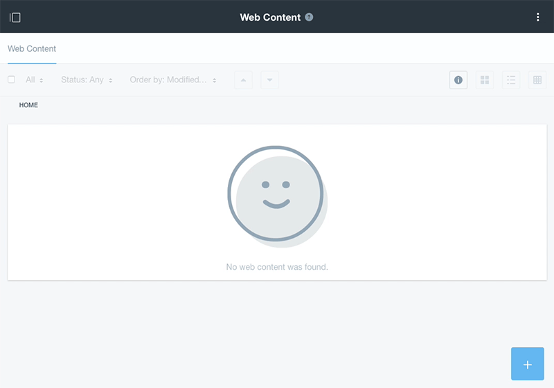
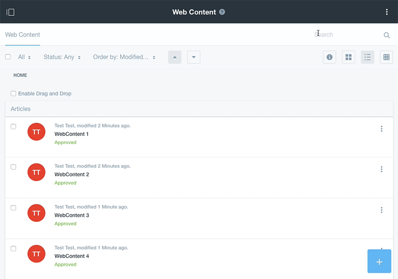
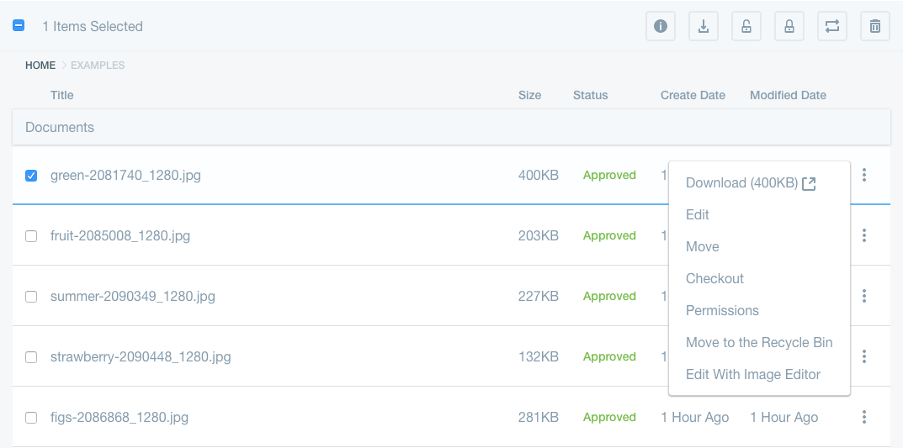
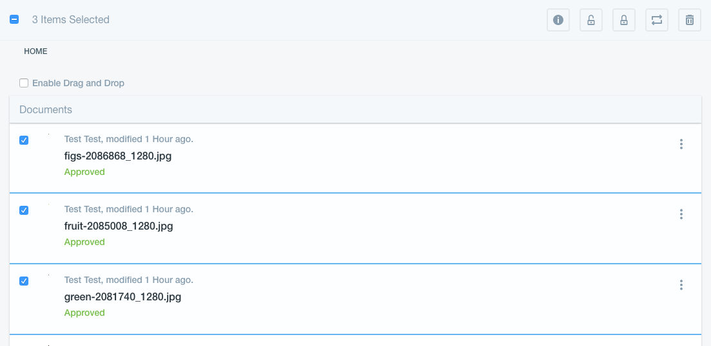
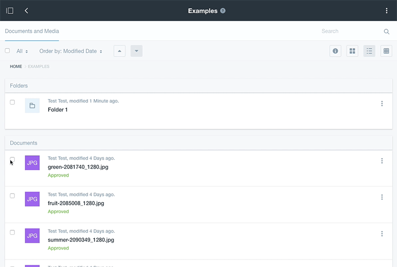

A dataset display is the combination of a [management bar](./management_bar.html) with one or many data visualization types. The most common visualization types used are [table](./table.html), [list](./list.html) and [card](./card.html).

## Usage
This pattern is used when the elements of the visualization require colective management, therefore the management bar becomes important as it has to facilitate the tools needed to work with the data set.

## Empty state

It is important to let the user know what happends in empty states and let them know what has happend and how to perform actions to move out from that empty state.

In Lexicon we use our [emoticons library](https://github.com/marcoscv-work/liferay-emoticons) as a visual support together with a text message to help the user. It is very important that this message is clear and let the user understand what to do next.

## Empty search state

As stated in the previous case, it is important to help the user understanding what happens in empty states. Here is the example for a empty search result.

## Invidual actions

Individual actions are all those actions that an element has. This actions are always possible to reach from the element it self throw the actions menu. Some of this actions are also placed in the management bar when only one element fromt the dataset is selected. These actions are always represented by a metaphor, , they are buttons with icon. Only those actions that can be easily represented by an icon will be there. Not all possible represented by an icon must be there, only the ones considered as more relevant.

## Colective actions

Colective actions are shown in the management bar when more than one element is selected in the dataset. In case there are  colective actions that don't have an icon representation the can be placed in a dropdown triggered from the actions button.

### Drag and drop example

The following animations shows how a drag and drop action works in a list view.

