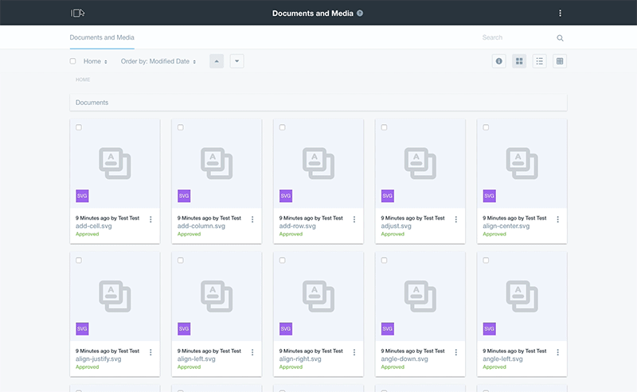

Side navigation pattern brings a panel from the leftmost or rightmost side of the screen pushing the content.

## Usage
This pattern is created to include portal main navigation in portal. This navigation is divided is 3 main areas: Control panel, User, and the Site. Different applications are contained inside each of this sections.

